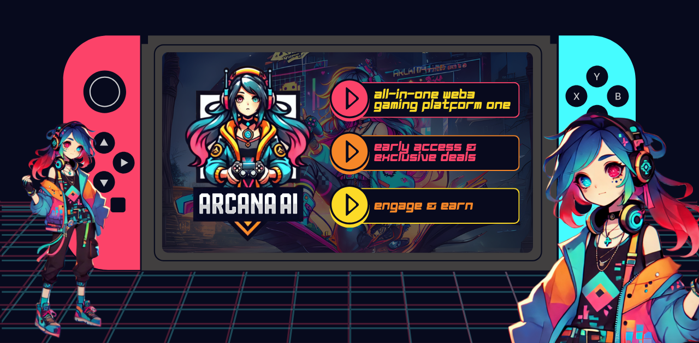
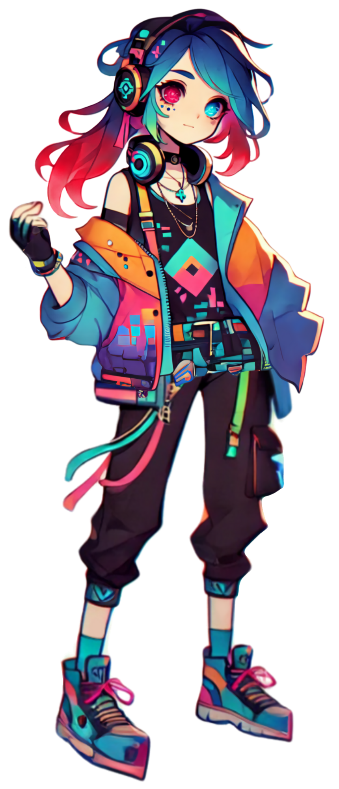

<div align="center">
  

  # Arcana - AI Agent

  [](https://nextjs.org/)
  [](https://www.typescriptlang.org/)


  <p>Arcana is an AI with its own personality.</p>

</div>

<div align="center">
  <h3>
    <a href="#features">Features</a>
    <span> · </span>
    <a href="#getting-started">Getting Started</a>
    <span> · </span>
    <a href="#ai-agents">AI Agent</a>
    <span> · </span>
    <a href="#tech-stack">Tech Stack</a>
    <span> · </span>
    <a href="#contributing">Contributing</a>
    <span> · </span>
    <a href="">Twitter</a>
    <span> · </span>
    <a href="">Docs</a>
    <span> · </span>
    <a href="">Pump.fun</a>
  </h3>
</div>

## CA
- $ARCANA: 6kXePskL6K23Q3vCrhdBcKqJ6QWAmBXCSztM52U9pump

## Features

- 🤖 Advanced AI Agent
- 📱 Responsive design across all devices

## Getting Started

1. Clone the repository:

# Install frontend dependencies
```console
cd agent-arcana
npm install
```

2. Set up environment variables:

# Frontend (.env.local)
GEMINI_API_KEY="your api key"


# Frontend (in a new terminal)
```console
cd agent-arcana
npm run dev
```

## AI Agent

### Arcana -  Gaming expert and crypto market enthusiast
<div align="center">
  
</div>

- **Version**: 1.0.0
- **Expertise**: Games, Cryptocurrencies
- **Specialties**:
  - In-depth knowledge of games
  - Futuristic vision on NFT games
  - Own personality

## Tech Stack

### Frontend
- Next.js 15
- TypeScript
- Tailwind CSS
- Framer Motion

### Backend
- Next.js Routers
- Gemini API


## Contributing

1. Fork the repository
2. Create your feature branch (`git checkout -b feature/amazing-feature`)
3. Commit your changes (`git commit -m 'Add some amazing feature'`)
4. Push to the branch (`git push origin feature/amazing-feature`)
5. Open a Pull Request


## Community & Resources

<div align="center">
  <a href="https://github.com/arcana-dev">
    
  </a>
  <a href="">
    
  </a>
  <a href="#">
    
  </a>
  <a href="">
    
  </a>
</div>

---
